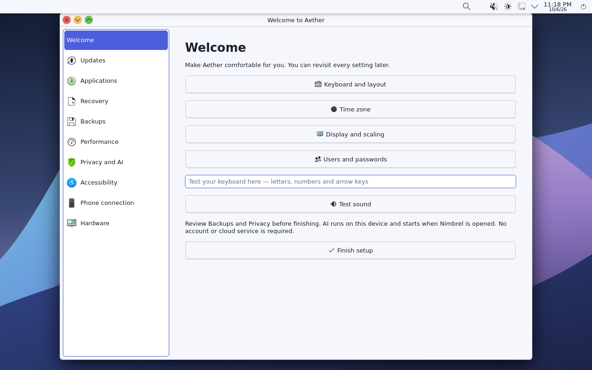

# October 6 development update

Aether is gaining a central place to manage everyday desktop features. This
work is a development candidate, not a completed stable release.

## Added in source and the candidate filesystem

- **Aether Settings:** first-run setup, updates, applications, recovery, backups,
  performance, privacy, accessibility, phone connection and firmware controls.
- **Applications:** native Flatpak and a rebuilt Discover with Flatpak support.
  Flathub is an explicit per-user opt-in. Permission controls use KDE's installed
  application-permissions module.
- **Local AI:** socket activation, idle unloading, a device-wide off switch,
  opt-in text-folder search, attachment previews and conversation deletion.
  Documents are never automatically submitted to the model.
- **Lightweight mode:** reversible animation, blur and indexing preferences.
- **Accessibility:** keyboard navigation, accessible control names, screen reader,
  font, scaling and contrast settings.
- **Phone connection:** KDE Connect, with explicit private-network firewall access.
  Pairing remains a user action. Private-address rules are not a trusted-network
  detector; turn them off on networks where discovery should not be allowed.
- **Firmware:** native fwupd/LVFS support, device inspection and explicit update
  approval. No automatic flashing or automatic hardware reports.
- **OS update preparation:** signed metadata and package verification, automatic
  checks, desktop notifications, explicit installation and no automatic restart.
  The trial system uses a separate ext4 system copy with shared user homes.

## Release trust remains unconfigured

The installed checker cannot use a public OS repository until an administrator
provisions reviewed public trust files. No disposable test key becomes release
trust, and no publisher credential is shipped. The [local key setup procedure](../src/updates/LOCAL-KEY-SETUP.md)
uses hidden passphrase prompts and explains offline key custody.

Application updates from an explicitly enabled Flatpak source are separate from
Aether OS updates. This build does not add Ubuntu or Arch binary repositories.

## Validation

The native builds completed using all 16 build-VM CPUs. Fourteen upstream
components were packaged individually and installed/configured successfully.
The pinned local inference engine was rebuilt and packaged separately too.
The Aether integration package also installed and rebuilt the initramfs.

Inside Aether's filesystem, 24 signature/TUF regressions and 25 feature tests
pass. New systemd units pass offline verification. Validation caught and fixed
launcher line endings, a missing `rsync` recovery dependency, a missing `stat`
utility in the recovery initramfs, and optional BMI2 instructions in the older
AI engine. Native packages now preserve their configuration files during upgrades.

A real local AI response passed in an isolated native Aether test root. Emulated
guest checks passed engine startup and idle unloading. First-run and desktop
notification checks passed, with the actual desktop captured below.

Recovery checks passed checkpoint entry, shared home access, fallback after an
unconfirmed trial, and making a healthy trial the default. The checkpoint copy
runs natively; the recovery checks boot the actual disk under emulation.
The final ISO and clean VMDK both passed BIOS and UEFI boot, login, desktop,
Flatpak sandbox, update timer and AI startup checks, with zero failed system
units. Failed and interrupted package-install tests also passed: the original
system, package database and boot selection remained unchanged. These fault
tests substitute the download-verification boundary; the signature tests cover
that boundary separately.

Physical phone pairing, firmware flashing and assistive hardware have not been
tested. Some older base libraries lack complete package ownership records; core
OS updates must remain gated until that inventory is reconciled.

The current desktop target remains x86_64 (also called x64). Historical 32-bit
x86 and ARM prototypes are preserved; these changes do not claim completed ports.

## Downloads

The [0.3.2 development release](https://github.com/Shadowman8080/Aether/releases/tag/0.3.2-dev.20261006)
contains the unified ISO, clean VMware disk bundle, source, native packages,
additional upstream sources, checksums and the detailed verification record.
The earlier 0.3.1 draft was interrupted and remains unpublished.

These are manual development downloads. Their SHA-256 checksums detect corruption;
they are not a signed public OS update feed. The VMware bundle targets virtual
hardware 22; native VirtualBox interaction and physical hardware testing remain
separate work.
